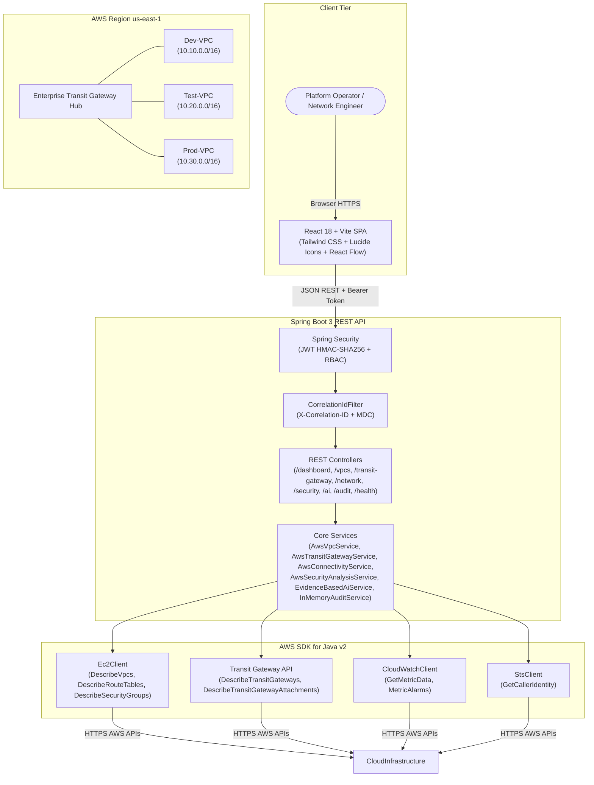
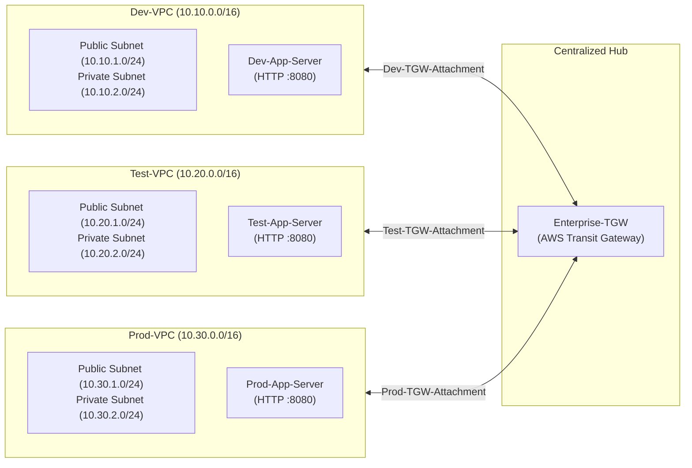
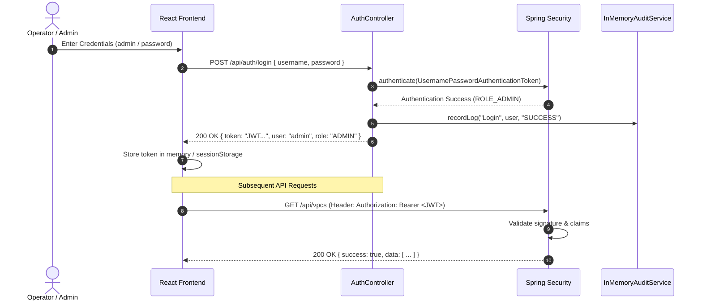

# CloudNexus: Enterprise Multi-VPC Network Management & Intelligence Platform

[]()
[]()
[]()
[]()
[]()

CloudNexus is an enterprise-grade cloud network management and intelligence platform designed to centralize visibility, operational observability, security governance, and AI-driven troubleshooting across multi-VPC AWS environments connected via AWS Transit Gateway.

---

## Table of Contents

1. [Platform Overview & Problem Statement](#1-platform-overview--problem-statement)
2. [High-Level Architecture](#2-high-level-architecture)
3. [AWS Multi-VPC Architecture](#3-aws-multi-vpc-architecture)
4. [Transit Gateway & Routing Architecture](#4-transit-gateway--routing-architecture)
5. [Application & Service Architecture](#5-application--service-architecture)
6. [Authentication & JWT Security Flow](#6-authentication--jwt-security-flow)
7. [AWS SDK v2 Integration](#7-aws-sdk-v2-integration)
8. [Network Monitoring & Observability](#8-network-monitoring--observability)
9. [Connectivity Diagnostics Engine](#9-connectivity-diagnostics-engine)
10. [Security Intelligence & Compliance](#10-security-intelligence--compliance)
11. [Evidence-Based AI Network Assistant](#11-evidence-based-ai-network-assistant)
12. [Enterprise Audit Trail](#12-enterprise-audit-trail)
13. [Technology Stack](#13-technology-stack)
14. [Local Development & Setup](#14-local-development--setup)
15. [Configuration & Environment Variables](#15-configuration--environment-variables)
16. [Testing & Verification](#16-testing--verification)
17. [Security Considerations & Learner Lab Limitations](#17-security-considerations--learner-lab-limitations)

---

## 1. Platform Overview & Problem Statement

### The Problem
As cloud footprints expand across enterprise accounts, multi-VPC networking rapidly evolves from manageable point-to-point VPC peerings into an unmaintainable mesh. Key operational challenges include:
- **Mesh Sprawl & Route Table Drift**: Managing $N(N-1)/2$ VPC peering connections causes operational overhead and asymmetric routing failures.
- **Fragmented Visibility**: Network engineers lack a single pane of glass to observe cross-VPC throughput, packet rejections, and instance health simultaneously.
- **Accidental Public Exposure**: Misconfigured security groups (e.g., `0.0.0.0/0` SSH/RDP ingress) introduce critical vulnerabilities into internal topologies.
- **Opaque Reachability Failures**: Diagnosing why workload `DEV` cannot reach `PROD` requires manually checking route tables, transit gateway attachments, and security groups.

### The Solution: CloudNexus
CloudNexus addresses these challenges by transforming raw AWS networking primitives into an automated intelligence platform:
- **Centralized Hub Management**: Orchestrates AWS Transit Gateway connecting DEV, TEST, and PROD VPC environments.
- **Real-Time Topology Discovery**: Automatically discovers live AWS VPCs, subnets, route tables, TGW attachments, and EC2 workloads.
- **Interactive Connectivity Diagnostics**: Evaluates cross-VPC reachability against live AWS policies and private routing tables.
- **Automated Security Intelligence**: Continuously audits security groups and network paths for overly permissive rules.
- **Evidence-Based AI Troubleshooting**: Diagnoses reachability bottlenecks and isolation policies grounded in verifiable AWS topology data.
- **Zero-Mutation Read-Only Architecture**: Enforces absolute safety by inspecting live infrastructure without modifying AWS configurations.

---

## 2. High-Level Architecture

CloudNexus strictly enforces separation between the presentation tier, integration layer, and cloud provider:



> **Security Mandate**: The React frontend **never holds AWS credentials** and never calls AWS APIs directly. Spring Boot serves as the secure, authenticated integration layer.

---

## 3. AWS Multi-VPC Architecture

The platform manages a multi-environment enterprise network partitioned into three distinct VPCs in the `us-east-1` region:



### Resource Matrix

| Environment | VPC Name | CIDR Block | Public Subnet | Private Workload Subnet | Workload Instance | Security Group |
| :--- | :--- | :--- | :--- | :--- | :--- | :--- |
| **DEV** | `Dev-VPC` | `10.10.0.0/16` | `10.10.1.0/24` | `10.10.2.0/24` | `Dev-App-Server` | `Dev-App-SG` |
| **TEST** | `Test-VPC` | `10.20.0.0/16` | `10.20.1.0/24` | `10.20.2.0/24` | `Test-App-Server` | `Test-App-SG` |
| **PROD** | `Prod-VPC` | `10.30.0.0/16` | `10.30.1.0/24` | `10.30.2.0/24` | `Prod-App-Server` | `Prod-App-SG` |

---

## 4. Transit Gateway & Routing Architecture

### Hub-and-Spoke Topology
Rather than point-to-point VPC peering connections, CloudNexus connects all VPCs to a central **Transit Gateway (`Enterprise-TGW`)** via VPC attachments:
1. `Dev-TGW-Attachment` -> `Dev-VPC`
2. `Test-TGW-Attachment` -> `Test-VPC`
3. `Prod-TGW-Attachment` -> `Prod-VPC`

### Route Propagation & Traffic Rules
- **DEV -> TEST**: Allowed on TCP port 8080 via Transit Gateway routing and `Test-App-SG`.
- **TEST -> PROD**: Allowed on TCP port 8080 for controlled staging data exchange.
- **DEV -> PROD**: **Restricted** by policy. Direct access from development environments to production workloads is denied at the security group ingress boundary.

---

## 5. Application & Service Architecture

The backend follows a service-oriented Spring Boot modular architecture:

- **`AwsVpcService`**: Queries live VPCs, CIDR ranges, subnets, and detects CIDR overlaps.
- **`AwsTransitGatewayService`**: Discovers the Transit Gateway, associated route tables, and attachment states.
- **`AwsEc2Service`**: Inspects workload nodes, operational states, private IP mappings, and instance types.
- **`AwsConnectivityService`**: Executes rule-based cross-VPC reachability evaluations and integrates with AWS Systems Manager (SSM) diagnostics.
- **`AwsNetworkFlowService`**: Manages VPC Flow Logs discovery and health metric compilation.
- **`AwsSecurityAnalysisService`**: Audits security groups for 0.0.0.0/0 exposure, unmanaged open ports, and risky ingress permissions.
- **`EvidenceBasedAiService`**: Synthesizes live infrastructure evidence to answer complex troubleshooting queries with grounded explanations.
- **`InMemoryAuditService`**: Maintains an immutable compliance event log bounded to 200 entries with thread-safe `CopyOnWriteArrayList`.
- **`HealthController`**: Unauthenticated endpoint returning application liveness and AWS STS availability.

---

## 6. Authentication & JWT Security Flow



---

## 7. AWS SDK v2 Integration

CloudNexus leverages the **AWS SDK for Java v2**:
- **Non-blocking Client Beans**: Spring-managed singleton beans for `Ec2Client`, `CloudWatchClient`, and `StsClient`.
- **Default Credentials Provider**: Seamlessly supports IAM Roles, Instance Profiles (`LabInstanceProfile`), AWS CLI profiles, and temporary session tokens.
- **Defensive Error Handling**: Catching AWS service exceptions (`403 Access Denied`, `400 Invalid Parameter`, network timeouts) cleanly, translating them into RFC-compliant error responses while maintaining platform availability.

---

## 8. Network Monitoring & Observability

- **Network Health Algorithm**: Computes a weighted operational score based on:
  - VPC attachment states (30%)
  - Route table propagation completeness (25%)
  - Workload instance status (25%)
  - Security posture & findings count (20%)
- **VPC Flow Logs**: Monitors active packet capture windows, rejection counts, and network anomalies.
- **CloudWatch Telemetry**: Aggregates CPU utilization, network in/out bytes, and packet metrics across multi-VPC workloads.

---

## 9. Connectivity Diagnostics Engine

Provides instantaneous reachability analysis between any two VPCs:
- **Routing Verification**: Verifies route table routes targeting `Enterprise-TGW`.
- **Security Policy Evaluation**: Validates destination security groups for appropriate source CIDR and port authorizations.
- **SSM Diagnostic Execution**: Where EC2 instances are online and SSM-managed, executes private network probes via `AWS-RunShellScript`.
- **Honest Telemetry**: When instances are stopped or offline, accurately reports evaluated policy status without fabricating fake latency or simulated ping outputs.

---

## 10. Security Intelligence & Compliance

Continuously analyzes AWS security groups against critical vulnerability vectors:
1. **Public SSH Exposure**: TCP port 22 open to `0.0.0.0/0` (Severity: HIGH).
2. **Public RDP Exposure**: TCP port 3389 open to `0.0.0.0/0` (Severity: HIGH).
3. **Unrestricted Ingress**: All protocols `-1` permitted from `0.0.0.0/0` (Severity: CRITICAL).
4. **Environment Isolation Breach**: Ingress rules allowing unauthorized traffic paths into the PROD VPC.

---

## 11. Evidence-Based AI Network Assistant

Unlike generic chat tools, the CloudNexus AI Assistant is **grounded in verifiable cloud evidence**:
- **Topology Awareness**: Ingests real VPC CIDRs, route tables, and instance states.
- **Root-Cause Analysis**: Explains connectivity bottlenecks citing specific security group rules and route table missing hops.
- **Risk Remediation**: Delivers prioritized, actionable steps for security findings.

---

## 12. Enterprise Audit Trail

- **Immutable Records**: Captures logins, diagnostics runs, AI analyses, and security scans.
- **Multi-Dimensional Filtering**: Search by action, operator, status (`SUCCESS`, `WARNING`, `CRITICAL`), and resource identifier.
- **Correlation IDs**: Emits `X-Correlation-ID` across all transactions for end-to-end observability and log tracing.

---

## 13. Technology Stack

| Layer | Technologies |
| :--- | :--- |
| **Frontend** | React 18, Vite 6, Tailwind CSS, Lucide React, React Flow, Recharts |
| **Backend** | Java 17+, Spring Boot 3.3, Spring Security 6, JJWT, Jackson |
| **Cloud SDK** | AWS SDK for Java v2 (EC2, CloudWatch, STS) |
| **Build & Tooling** | Maven Wrapper (`mvnw`), npm, Git |

---

## 14. Local Development & Setup

### Prerequisites
- JDK 17 or higher
- Node.js 18+ and npm
- AWS credentials with read-only access (optional for mock mode)

### 1. Backend Setup
```powershell
cd backend
.\mvnw.cmd spring-boot:run
```
*API runs at `http://localhost:8080`*

### 2. Frontend Setup
```bash
cd frontend
npm install
npm run dev
```
*UI runs at `http://localhost:5173`*

### Default Demonstration Credentials
- **Admin**: `admin` / `password` (Full access)
- **Viewer**: `viewer` / `password` (Read-only access)

---

## 15. Configuration & Environment Variables

| Variable | Description | Default |
| :--- | :--- | :--- |
| `SERVER_PORT` | Backend HTTP port | `8080` |
| `AWS_REGION` | Target AWS region | `us-east-1` |
| `CLOUDNEXUS_DATA_SOURCE` | Service provider (`aws` or `mock`) | `aws` |
| `JWT_SECRET` | Cryptographic signing key | Development Key |
| `AWS_ACCESS_KEY_ID` | AWS IAM Access Key | Sourced from environment / IAM role |
| `AWS_SECRET_ACCESS_KEY`| AWS IAM Secret Key | Sourced from environment / IAM role |
| `AWS_SESSION_TOKEN` | AWS Session Token (Learner Lab) | Sourced dynamically |

---

## 16. Testing & Verification

```powershell
# Run backend test suite (56 tests)
cd backend
.\mvnw.cmd clean test

# Build frontend production bundle
cd ../frontend
npm run build
```

---

## 17. Security Considerations & Learner Lab Limitations

- **Read-Only Guarantee**: CloudNexus cannot alter, delete, or create AWS resources.
- **Zero Secrets**: Credentials are never bundled in client code or stored in Git.
- **Learner Lab Awareness**: Handles transient session token expirations, restricted VPC Flow Log setups, and stopped EC2 nodes gracefully without crashing.