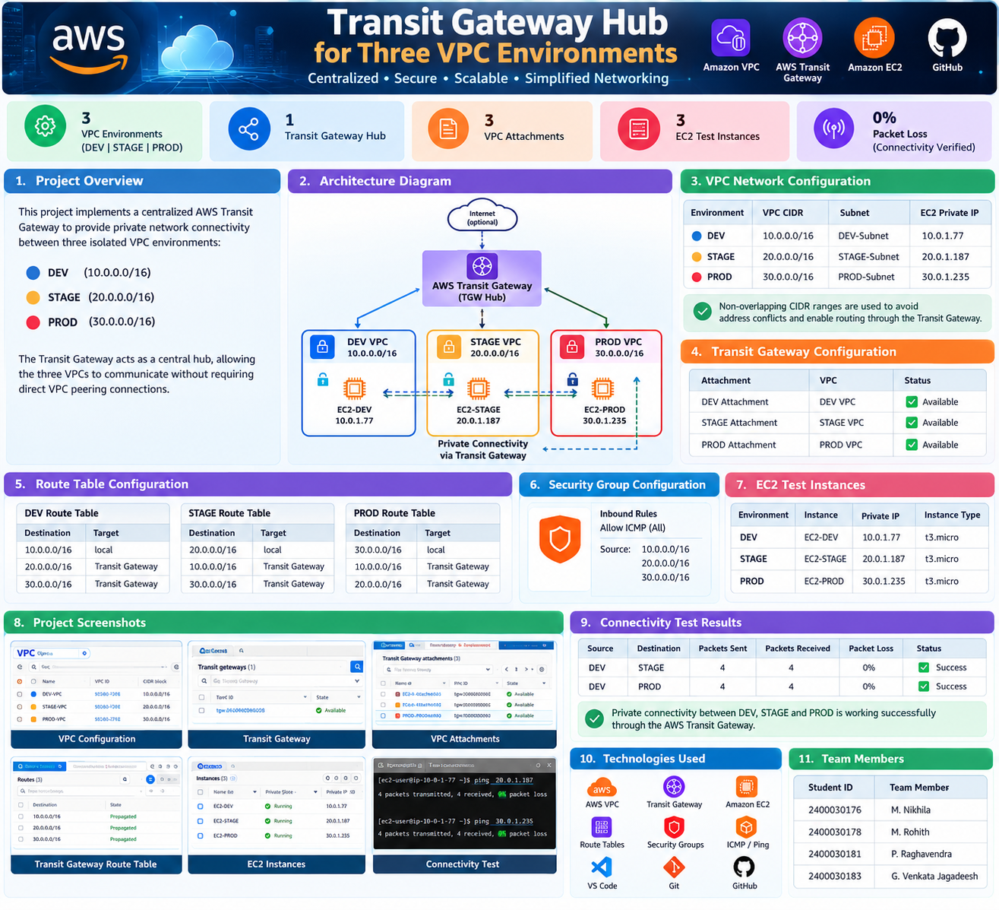
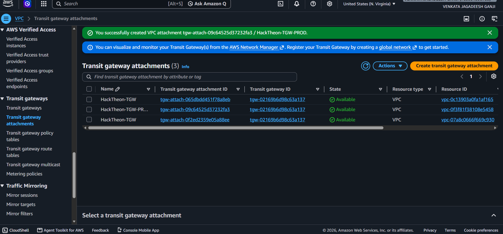

<p align="center">
  
</p>

<h1 align="center">🚀 Transit Gateway Hub for Three VPC Environments</h1>

<p align="center">
  <b>Centralized • Secure • Scalable • Simplified AWS Networking</b>
</p>

<p align="center">
  
  
  
  
  
</p>

---

## 📌 Project Overview

This project implements a centralized **AWS Transit Gateway Hub** to provide private network connectivity between three isolated VPC environments:

- 🟦 **DEV** — `10.0.0.0/16`
- 🟨 **STAGE** — `20.0.0.0/16`
- 🟥 **PROD** — `30.0.0.0/16`

The Transit Gateway acts as a central networking hub, allowing the three VPCs to communicate without requiring direct VPC peering connections.

---

## 🎯 Project Objectives

- Create three independent AWS VPC environments.
- Connect the VPCs using a centralized AWS Transit Gateway.
- Configure VPC attachments for DEV, STAGE, and PROD.
- Configure Transit Gateway route propagation.
- Configure VPC route tables for inter-VPC communication.
- Deploy EC2 instances for connectivity testing.
- Verify connectivity using ICMP ping.
- Document and maintain the project using Git and GitHub.

---

## 🏗️ Architecture

<p align="center">
  
</p>

### 🌐 Network Architecture

```text
                         ┌─────────────────────────┐
                         │     AWS TRANSIT         │
                         │       GATEWAY           │
                         │        TGW HUB          │
                         └────────────┬────────────┘
                                      │
                 ┌────────────────────┼────────────────────┐
                 │                    │                    │
                 ▼                    ▼                    ▼
          ┌─────────────┐      ┌─────────────┐      ┌─────────────┐
          │   DEV VPC   │      │  STAGE VPC  │      │   PROD VPC  │
          │ 10.0.0.0/16 │      │ 20.0.0.0/16 │      │ 30.0.0.0/16 │
          └──────┬──────┘      └──────┬──────┘      └──────┬──────┘
                 │                    │                    │
                 ▼                    ▼                    ▼
             EC2-DEV              EC2-STAGE             EC2-PROD
             10.0.1.77             20.0.1.187             30.0.1.235