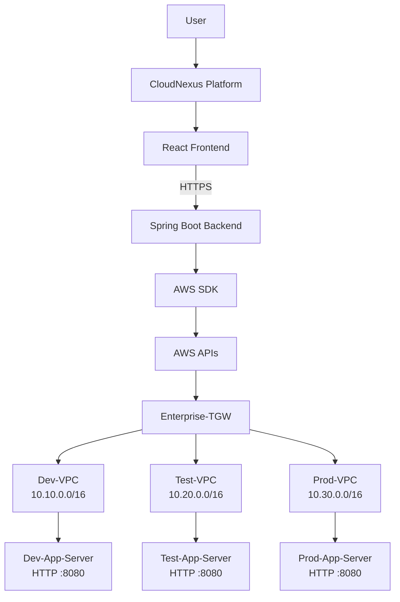

# Enterprise Multi-VPC Network Hub Using AWS Transit Gateway

CloudNexus is the planned name for a network-management platform built around this AWS networking demonstration. The current repository documents an enterprise-style hub-and-spoke topology for DEV, TEST, and PROD environments.

## Table of Contents

- [Overview](#overview)
- [Architecture](#architecture)
- [Implemented Lab Scope](#implemented-lab-scope)
- [Network Configuration](#network-configuration)
- [Routing and Security](#routing-and-security)
- [Connectivity Testing](#connectivity-testing)
- [Technology Stack](#technology-stack)
- [Security Principles](#security-principles)
- [Setup](#setup)
- [Future Scope](#future-scope)

## Overview

AWS Transit Gateway provides a centralized network hub for three VPCs. Each VPC connects to the hub through a dedicated VPC attachment, avoiding a growing set of direct VPC-to-VPC connections.

The lab demonstrates VPCs, subnets, route tables, Internet Gateways, EC2, Security Groups, Transit Gateway attachments, Session Manager administration, and cross-VPC private connectivity testing over HTTP.

## Architecture



The frontend must not hold AWS credentials or call AWS resources directly. The intended flow is React -> Spring Boot -> AWS SDK -> AWS APIs. Private workload traffic follows the VPC route table, Transit Gateway, destination attachment, destination VPC, and destination EC2 path.

## Implemented Lab Scope

The documented lab scope includes the AWS network, one EC2 application server per environment, simple HTTP responses on port `8080`, and Session Manager-based administration. The CloudNexus frontend, Spring Boot backend, JWT authentication, AWS SDK management APIs, and AI assistant are planned architecture unless implemented elsewhere in the repository.

## Network Configuration

All resources are documented in the `us-east-1` Region.

| Environment | VPC | CIDR | Public subnet | Private application subnet | EC2 server | Response |
| --- | --- | --- | --- | --- | --- | --- |
| DEV | `Dev-VPC` | `10.10.0.0/16` | `10.10.1.0/24` | `10.10.2.0/24` | `Dev-App-Server` | `HELLO FROM DEV VPC` |
| TEST | `Test-VPC` | `10.20.0.0/16` | `10.20.1.0/24` | `10.20.2.0/24` | `Test-App-Server` | `HELLO FROM TEST VPC` |
| PROD | `Prod-VPC` | `10.30.0.0/16` | `10.30.1.0/24` | `10.30.2.0/24` | `Prod-App-Server` | `HELLO FROM PROD VPC` |

Public subnets are intended for resources that need a path through an Internet Gateway. Private application subnets are reserved for internal workloads without direct Internet exposure. The current learner-lab implementation uses EC2 instances in the public application/testing path for simplicity; it is not a fully private EC2 deployment.

Each VPC has its own Internet Gateway: `Dev-IGW`, `Test-IGW`, and `Prod-IGW`. Public route tables are `Dev-Public-RT`, `Test-Public-RT`, and `Prod-Public-RT`.

## Routing and Security

The Transit Gateway is `Enterprise-TGW`, with attachments `Dev-TGW-Attachment`, `Test-TGW-Attachment`, and `Prod-TGW-Attachment`. The intended Transit Gateway routes map `10.10.0.0/16`, `10.20.0.0/16`, and `10.30.0.0/16` to the corresponding attachment.

The intended VPC routes are DEV -> TEST and PROD, TEST -> DEV and PROD, and PROD -> DEV and TEST, all through `Enterprise-TGW`. Verify route tables in AWS before treating any route as present in a live account.

The application Security Groups are `Dev-App-SG`, `Test-App-SG`, and `Prod-App-SG`. The intended policy allows DEV -> TEST and TEST -> PROD on TCP port `8080`; the PROD policy restricts DEV -> PROD. Routing and Security Group rules work together, and Security Groups alone do not implement the entire network security model.

## Connectivity Testing

Run tests from an EC2 instance through Session Manager using private addresses:

```bash
curl http://<TEST_PRIVATE_IP>:8080
# HELLO FROM TEST VPC

curl http://<PROD_PRIVATE_IP>:8080
# HELLO FROM PROD VPC
```

The DEV -> PROD request should be restricted according to the PROD Security Group policy. Keep private IPs as placeholders in committed documentation.

## Technology Stack

| Area | Technologies |
| --- | --- |
| AWS lab | Amazon VPC, Transit Gateway, EC2, Systems Manager, IAM, Internet Gateway, route tables, Security Groups |
| Planned frontend | React, Vite, TypeScript, Tailwind CSS, React Router, React Flow |
| Planned backend | Java, Spring Boot, Maven, Spring Security, JWT, AWS SDK for Java |
| Development | Git, GitHub, VS Code, GitHub Copilot / AI-assisted development |
| Planned operations | CloudWatch where implemented, monitoring, and audit information |

## Security Principles

- Never hardcode AWS credentials, API keys, or secrets.
- Never commit secret `.env` files, `node_modules`, or build output.
- Prefer IAM roles and instance profiles, including `LabInstanceProfile` in the learner lab.
- Use least privilege and Session Manager instead of unnecessary public SSH access.
- Keep environments separated and use private IPs for internal application traffic.
- Keep a human in control of production changes; AI must not automatically modify production networking or security configuration.

## Setup

See [docs/setup.md](docs/setup.md) for the step-by-step AWS setup, application deployment, connectivity checks, troubleshooting, and cleanup guidance.

## Future Scope

Planned improvements include a React topology visualization, Spring Boot AWS management APIs, AWS SDK integration, CloudWatch monitoring, VPC Flow Logs, a network health dashboard, automated diagnostics, AI-assisted troubleshooting, role-based access control, audit logging, Terraform or CloudFormation, CI/CD, automated validation, private-subnet architecture, multi-Availability Zone high availability, and centralized security monitoring. These remain future scope unless implemented in the repository.